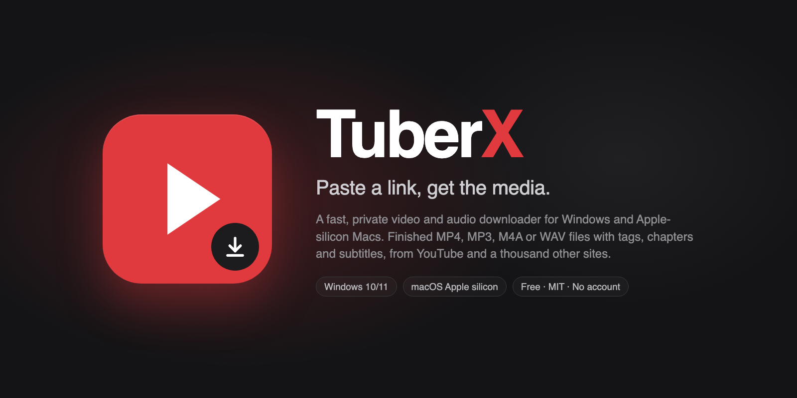
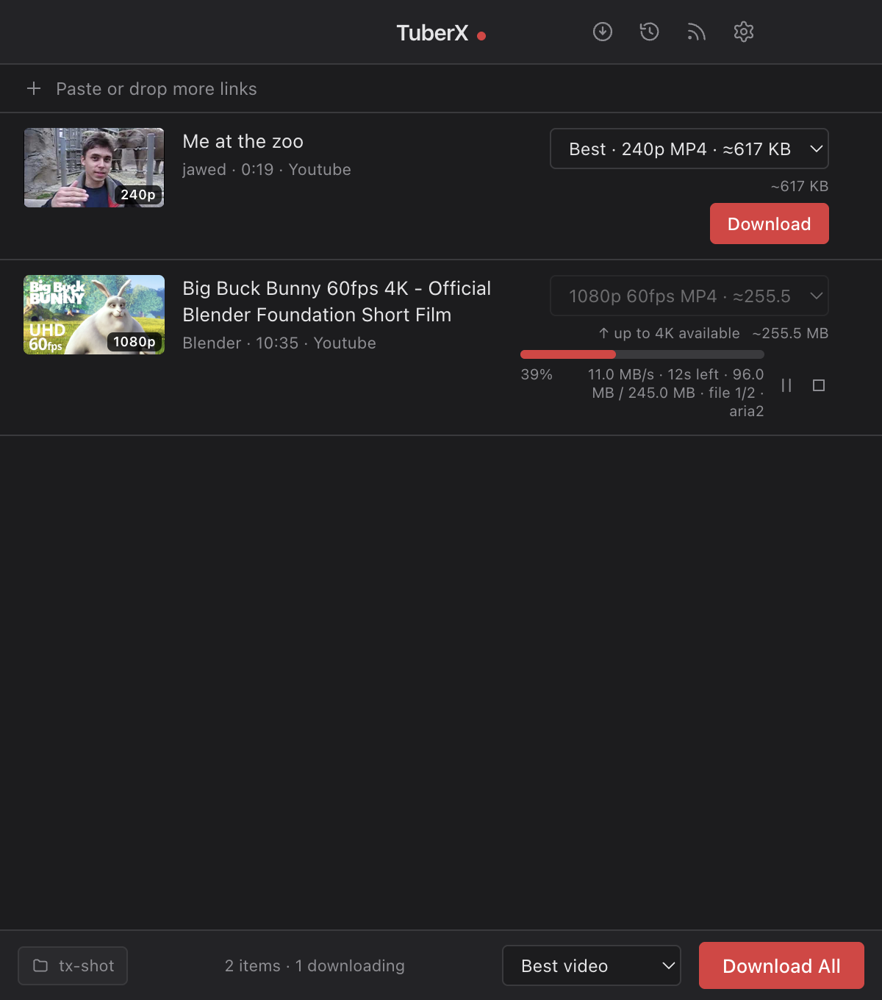

<p align="center">
  
</p>

<p align="center">
  <strong>TuberX turns a link into a finished file. Paste, pick a quality, done.</strong>
  <br /><br />
  A fast, private video and audio downloader for Windows and Apple-silicon Macs. It produces MP4, MP3, M4A or WAV files that are ready to use the moment they land: tags, cover art, chapters and subtitles already inside. YouTube, Vimeo, Facebook, Instagram, Dailymotion, SoundCloud, Mixcloud, Bandcamp, Youku and the thousand other sites the yt-dlp engine knows, with an engine that updates itself so a site change never waits for an app release. Trim clips on a preview, split by timecodes, follow playlists and channels, convert to H.264 or H.265 on your GPU. No account, no telemetry, no upsell.
</p>

<p align="center">
  <a href="https://github.com/DRAZY/TuberX/releases/latest"></a>
  <a href="https://github.com/DRAZY/TuberX/releases"></a>
  <a href="https://github.com/DRAZY/TuberX/stargazers"></a>
  
  <br />
  
  
  
  
  
</p>

<p align="center">
  <a href="https://github.com/DRAZY/TuberX/releases/latest"><strong>Download the latest release</strong></a> · Windows installer · Windows portable exe · macOS dmg
</p>

---

## What TuberX is for

You found a video, a talk, a mix, an album, a lecture series. You want it as a file on your machine, in the format your player or editor expects, without a browser extension farm, a converter website or a "premium" nag. TuberX is that one window. It is built for people who download often: a queue that survives a crash, a quality you can see before you commit, a Later list, a history that remembers where every file went, and subscriptions that fetch the new uploads for you.

<p align="center">
  
</p>

## Features

### Add links your way
- **Paste and go.** Ctrl+V anywhere in the window, right-click › Paste link, drag a link in, or drop a text file full of links. A link copied while you were in the browser is offered the moment you come back: one click adds it, or adds and downloads it.
- **Playlists and channels.** A playlist link opens a picker with search, select-all and Download all later. A single video that belongs to a playlist asks which you meant.
- **Subscriptions.** Follow a playlist or channel from the picker. Every launch (and every six hours while open) TuberX spots the new videos, badges the count in the title bar, and queues them in one click.
- **Browser extension.** Send the current page or any link from Chrome, Edge or Firefox with a click or Ctrl+Shift+P (Ctrl+Shift+L for Download Later).
- **Queue you control.** Drag rows to set the download order. Select several and act on them together. Export the queue, Later or History as a text file of links.

### Quality you can see
- **The full ladder per video**, from best down to 360p, with frame rate and an estimated finished size beside each choice, plus MP3, M4A, WAV, an M4R ringtone and subtitles-only. An "Apply to all" control sets one choice for the whole list.
- **Finished files.** MP4 with H.264/AAC preferred so it plays on stock Windows; subtitles embedded (auto-captions as fallback); chapters from the video's timestamps; cover art; title and artist tags. MP3 at your chosen bitrate (320 kbps by default). M4A as the original stream, no re-encode. WAV as lossless 16-bit PCM for editing.
- **Your codec, your GPU.** Choose H.264 for compatibility or H.265 for smaller files. Sources that arrive in VP9 or AV1 are converted after the download with the hardware encoder on your machine (Apple VideoToolbox, NVIDIA NVENC, Intel Quick Sync, AMD AMF), software as the fallback, with progress on the row.

### Edit without another app
- **Trim with preview.** Scrub the downloaded video, set in and out points (chapters are one-click presets), and export the clip as MP4, M4A or a 40-second M4R ringtone. Instant keyframe cuts or frame-accurate re-encoded cuts. The original is never touched.
- **Split by timecodes.** Paste a tracklist or use the video's chapters: one file per part with titles and track numbers, or write the list into the file as chapters.
- **Batch rename.** Prefix, suffix, numbering and a live preview of every new name across the selected rows. Rows and history follow the rename.

### Fast and unbreakable
- **Speed.** A parallel engine: the video track, the audio track, the subtitles and the cover download at the same time, each through aria2c with sixteen connections, and one ffmpeg pass then writes the finished file once with everything inside. Measured on a 245 MB 1080p60 video, 53 s became 23 s. Up to eight downloads at once, HLS/DASH fragments in parallel, an optional speed limit for shared networks. Links resolve in a couple of seconds and downloads begin immediately from the metadata already fetched.
- **Pause, Stop, Resume, Download again.** Pause keeps what has been transferred. A different quality of a file you already have lands beside it, never over it.
- **Self-healing.** A transfer that goes silent restarts itself and resumes. A site that changed its pages triggers an immediate yt-dlp update and a retry. The engine also checks for a new build daily, independent of app releases. Every engine line is logged and one click away for support.
- **After the queue.** Open the folder, put the machine to sleep or shut it down when the last download finishes, with a 30-second warning you can cancel. Finished rows open in the default app, in an app you choose, or reveal in the folder.

### Access and privacy
- **No account needed.** Cookies, a site login and a video password are there for private, age-restricted or members-only media, and only then. Passwords live in the OS keychain. A user-agent choice (desktop, iPhone, Android) is available for sites that serve phones differently.
- **Network.** Proxy, Prefer IPv4 (on by default, which is what clears YouTube's "confirm you're not a bot"), and a bundled PO-token helper.
- **Private by construction.** No analytics, no crash reporting, no accounts, MIT licensed. Settings, history and logs stay in your app-data folder.
- **Eight languages.** English, Español, Deutsch, Français, Português, Italiano, 日本語, 简体中文, following the system or your pick.

## Supported sites

YouTube (videos, Shorts, playlists, channels), Vimeo, Facebook, Instagram, Dailymotion, SoundCloud, Mixcloud, Bandcamp, Youku, and every other site the [yt-dlp](https://github.com/yt-dlp/yt-dlp) engine supports, which is most of the web.

## Install

- **Windows 10/11 (x64):** run `TuberX-Setup-<version>-x64.exe`, or use `TuberX-Portable-<version>-x64.exe` with no install. The portable build is self-extracting, so allow it a moment on launch while it expands. Both keep settings, history and logs in `%APPDATA%\TuberX`.
- **macOS (Apple silicon):** open the `.dmg` and drag TuberX to Applications.

TuberX checks GitHub Releases for a new version at launch and every six hours, and says so in the title bar and under Settings → About. The Windows installer build downloads and applies the update in place; the portable exe and the Mac build open the release page for the new file. Nothing installs without you, and the check can be turned off.

### macOS: first launch

The Mac build is signed ad hoc, not notarized with an Apple developer certificate, so the first launch shows "Apple could not verify TuberX is free of malware". Click Done, open System Settings → Privacy & Security, scroll to the notice about TuberX and click **Open Anyway**. Right-click → Open on the app also works. This is a one-time step; updates keep the permission.

## Window

TuberX opens as a compact applet (600×680) centred on your main display, painted before it is shown so there is no white flash. Resize or move it and it reopens exactly there next time; if that spot is no longer on a connected display it falls back to the centred default. Minimum size is 480×420.

## Settings

- **Language:** system language or one of eight.
- **Destination:** default is `Videos\TuberX`; the last fifteen folders you picked are remembered.
- **Output:** default quality, convert non-MP4 sources, video codec (auto / H.264 / H.265 with the detected hardware encoder), MP3 bitrate.
- **Subtitles:** embed, also save `.srt` files, languages.
- **Thumbnails:** save beside the file as JPG or PNG.
- **Downloads:** re-download naming (keep both files or replace), skip files already downloaded, speed limit, what happens when the queue finishes, concurrent downloads (1–8), aria2c on/off, notifications.
- **Network:** proxy, Prefer IPv4 (on by default), cookies from a browser, a cookies.txt file, and the PO-token helper (when needed, always, or off; each run of it costs 10 to 60 seconds, so "when needed" is the default).
- **Site login:** username and password (keychain), video password, user-agent choice.
- **Engine:** status of every bundled tool, a manual "Update yt-dlp now", and the log folder.
- **About:** version, platform and links.

The Settings, Later, History and Subscriptions drawers close when you click outside them, press Escape, or add a link, and Settings has a Done button; changes apply the moment you make them.

## Re-downloading and existing files

TuberX never replaces a file you already have with a different format. The rules, in order:

1. **A different quality or format of a link you already downloaded** lands beside the existing file with the quality in its name: `Title.mp4` stays, `Title [1080p].mp4` is added. This applies whether you use Download again on the row, or paste the link again after removing the row.
2. **The same format again** (Download again on a row without changing the dropdown) refreshes that one file in place. It only does so when the file is on record as produced by that same format.
3. **Audio formats never collide with video.** MP3, M4A and WAV have their own extensions, so they always sit beside the video.
4. **Nothing on record** (history cleared, files copied from another machine): a video file in the destination with this title still counts as existing, and the new quality gets the tag. If yt-dlp still meets an existing file, TuberX stops it before anything is touched and retries with the tag.

Settings → Downloads → "Re-downloading in a different format" switches rule 1 to *Replace the existing file* if you prefer one file per link.

## Troubleshooting

**"Sign in to confirm you're not a bot" from YouTube.** Almost always an IPv6 connection; TuberX connects over IPv4 by default, which resolves it. If it persists, the bundled PO-token helper handles most of the rest, and Settings → Network has cookie options as a last resort.

**The end of a download takes a while.** With the parallel engine the finishing pass is a single write and takes about a second on an SSD; the log line `fast: done in …` breaks a job down into select, streams, finish and move so a slow step is named. The classic pipeline (Settings → Downloads → Parallel engine off) still works the old way: After the transfer, yt-dlp merges video and audio, embeds subtitles, writes tags and chapters, and moves the file, and each of those passes rewrites the whole file. The row names the pass and counts the seconds. Large files on a slow disk, a OneDrive folder or under antivirus scanning are the slow cases. When the destination is on another drive, TuberX keeps its temporary files there too, so the final step is a rename rather than a copy. A forced codec adds a conversion pass with its own progress.

**A download stops moving.** The row says "no data for N s" as soon as the engine goes quiet. After 90 s of silence TuberX kills the transfer and restarts it, and aria2c and yt-dlp continue from what is already on disk; after three silent runs in a row the row fails with a message. Stop and Pause always land within a few seconds, even when the downloader is wedged.

**A site stopped working.** An extractor error makes TuberX check for a newer yt-dlp at once, install it, and retry. If the site is still failing after that, wait for the next yt-dlp release; Settings → Engine → Update yt-dlp now checks on demand.

**A download is slow or fails.** Every yt-dlp line for every download is written to `engine.log` (Settings → Engine → Open log folder) in the app-data folder (`%APPDATA%\TuberX\logs` on Windows, `~/Library/Application Support/TuberX/logs` on macOS). It is the first thing to attach to a problem report.

**"This video is DRM-protected."** The site serves that video only through DRM, and no downloader can take it.

## Building from source

```bash
bun install
bun scripts/fetch-tools.ts          # engine binaries for this machine (dev)
bun scripts/fetch-tools.ts win32    # engine binaries the Windows build bundles
bun scripts/fetch-pot.ts            # PO-token helper for both platforms
bun run dev                          # Vite + Electron
bun test                             # unit tests
bun scripts/site-check.ts           # resolve one public URL per supported site
bun run build:win                    # Windows installer + portable exe
bun run build:mac                    # macOS arm64 dmg + zip
```

macOS builds also need `bash scripts/build-aria2-mac.sh` once, because no static arm64 aria2c is published upstream.

Architecture in short: Electron + Vue 3 + Pinia + Tailwind, bundled by Vite and electron-builder. The engine is a set of external processes under `resources/bin/<platform>/` (`yt-dlp` onedir, `ffmpeg`, `aria2c`, `deno`) driven over stdout by the main process; the renderer never touches the file system or spawns anything. State is a SQLite database (node:sqlite) plus an electron-store settings file; secrets go through Electron's safeStorage.

## Third-party software

TuberX bundles yt-dlp (Unlicense), FFmpeg (GPL build), aria2 (GPL), Deno (MIT) and the bgutil PO-token provider (GPL-3.0). See `THIRD_PARTY_LICENSES.md`. Media you download is subject to the terms of the site it comes from and to copyright law; TuberX is a tool, and what you do with it is yours to answer for.

## License

MIT. See `LICENSE`.
